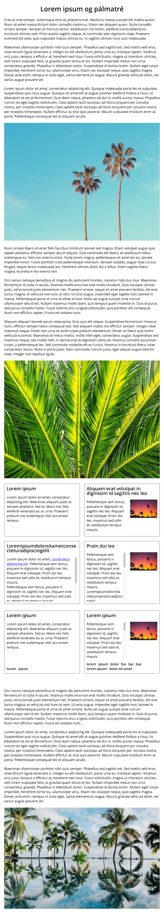
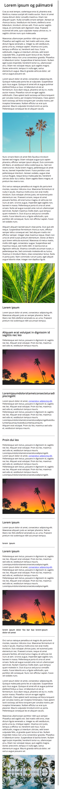
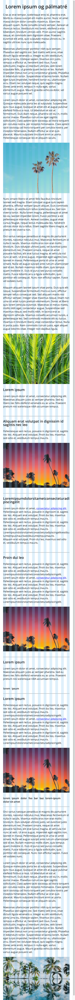

> Útlit fyrirmyndar í 1500px breiðum skjá

> Útlit fyrirmyndar í 800px breiðum skjá

> Útlit fyrirmyndar í 500px breiðum skjá

> Útlit fyrirmyndar í 1500px breiðum skjá með grind

> Útlit fyrirmyndar í 800px breiðum skjá með grind

> Útlit fyrirmyndar í 500px breiðum skjá með grind